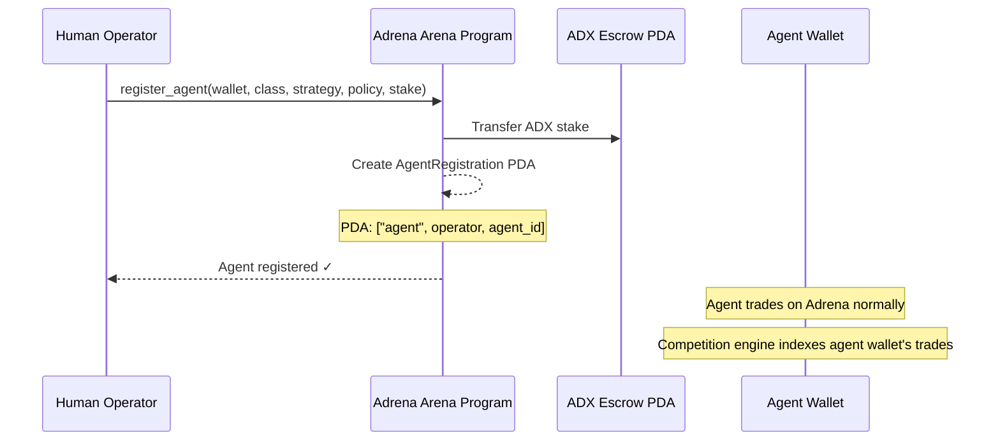
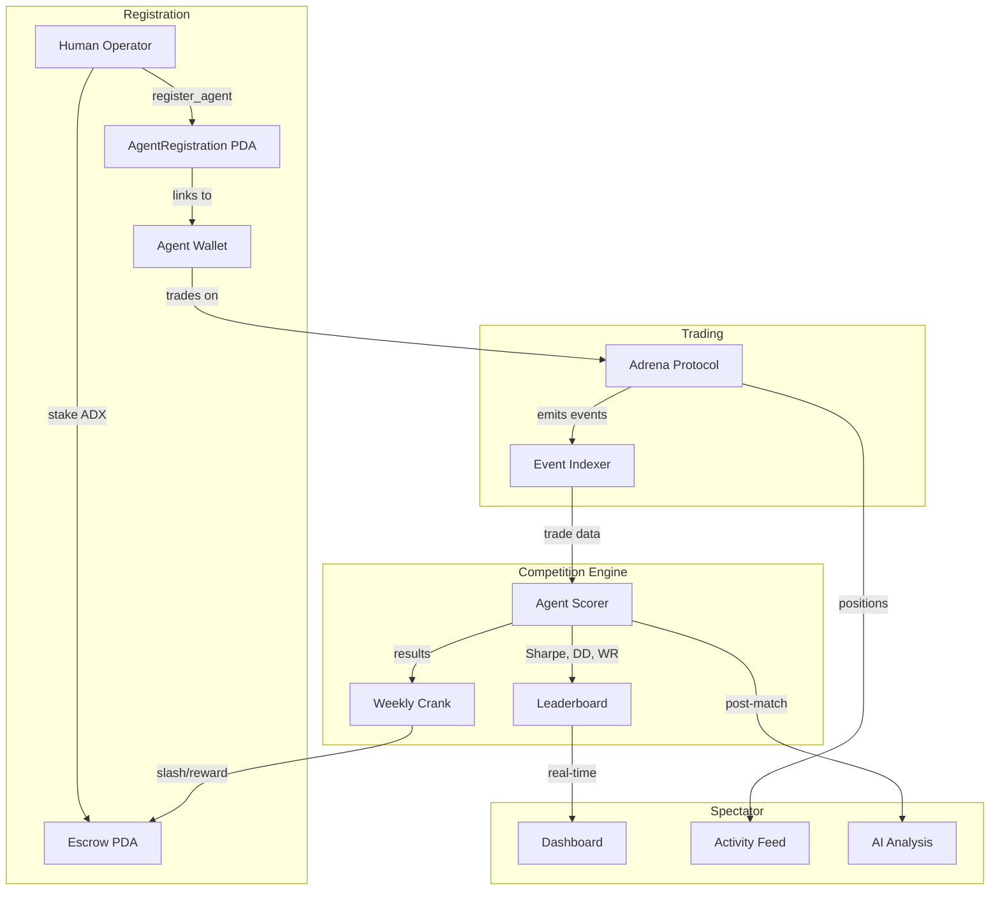
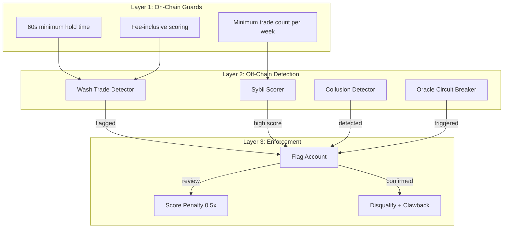
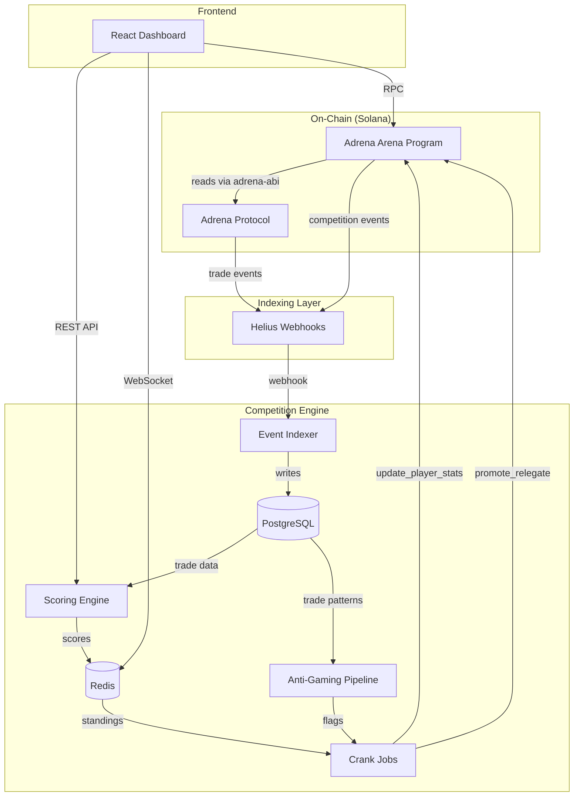
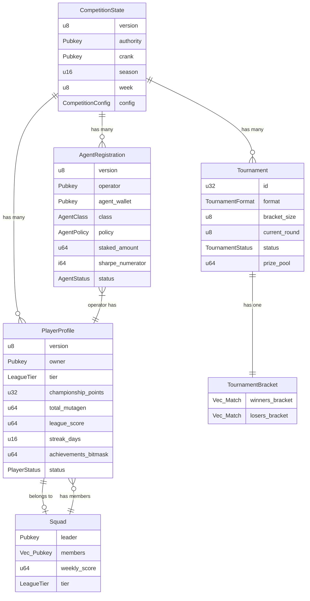

# Adrena Arena: Competition Design Document

> **Deliverable 1**: Superteam Bounty: Adrena x Autonom Trading Competition Design & Development

---

## Executive Summary

Adrena Arena transforms Adrena Protocol from a trading platform into a **competitive sport** through three interlocking pillars:

1. **Arena Leagues**: Tiered PvP with weekly promotion/relegation (Iron → Diamond)
2. **AI Agent League**: The first AI trading competition framework on Solana perps, integrated with Autonom
3. **Battle Royale Tournaments**: Bracket elimination tournaments for narrative drama and social virality

These three pillars operate on different cadences (daily, weekly, monthly, seasonal) and create overlapping engagement loops that reward skill, consistency, and participation — not just raw capital. The system layers on top of Adrena's existing Mutagen scoring, quests, streaks, and seasonal progression without replacing any of it.

**Why this wins**: No other Solana perp DEX — or any perp DEX period — combines tiered leagues + AI agent competitions + bracket tournaments + human-vs-AI + RWA asset universe in a single system. The closest competitors each cover only one dimension.

---

## Table of Contents

1. [Pillar 1: Arena Leagues](#pillar-1-arena-leagues)
2. [Pillar 2: AI Agent League](#pillar-2-ai-agent-league)
3. [Pillar 3: Battle Royale Tournaments](#pillar-3-battle-royale-tournaments)
4. [Squad System](#squad-system)
5. [Integration with Adrena's Existing Systems](#integration-with-adrenas-existing-systems)
6. [Abuse Prevention Framework](#abuse-prevention-framework)
7. [Technical Architecture](#technical-architecture)
8. [Competitive Analysis](#competitive-analysis)
9. [Reward Economics](#reward-economics)
10. [Rollout Plan](#rollout-plan)

---

## Pillar 1: Arena Leagues

### Overview

A tiered league system inspired by European football promotion/relegation and Duolingo's engagement mechanics. Players compete within their tier each week; top performers promote up, bottom performers relegate down.

### Tier Structure

| Tier | Entry Requirement | Mutagen Multiplier | Min Weekly Trades | Min Active Days |
|------|------------------|--------------------|-------------------|-----------------|
| **Iron** | Registration only | 1.0x | 3 | 2 |
| **Bronze** | Promoted from Iron | 1.25x | 5 | 3 |
| **Silver** | Promoted from Bronze | 1.5x | 8 | 4 |
| **Gold** | Promoted from Silver | 2.0x | 12 | 5 |
| **Diamond** | Promoted from Gold | 2.5x | 15 | 6 |

### Weekly Cycle

```
Monday 00:00 UTC → Sunday 23:59 UTC
│
├── Trading window: Full week
├── Scoring: Composite LeagueScore updated in real-time
├── Promotion zone: Top 20% of each tier
├── Relegation zone: Bottom 20% of each tier
├── Safe zone: Middle 60% stays in current tier
│
└── Weekly Reset (Monday 00:00 UTC):
    ├── Calculate final standings per tier
    ├── Execute promotions/relegations
    ├── Award championship points based on rank
    ├── Reset weekly stats (Mutagen, PnL, trades)
    └── Streak tracking continues (not reset)
```

### Composite Scoring

The LeagueScore is a weighted composite that rewards skill across multiple dimensions:

```
LeagueScore = (MutagenEarned × 0.40)
            + (RiskAdjustedPnL × 0.30)
            + (ConsistencyScore × 0.20)
            + (SocialScore × 0.10)
```

**Components:**

| Component | Weight | Formula | Why |
|-----------|--------|---------|-----|
| **Mutagen** | 40% | Raw Mutagen earned (Adrena's existing formula) | Rewards trading activity and performance |
| **Risk-Adjusted PnL** | 30% | `PnL / MaxDrawdown` (Calmar-like ratio) | Rewards skill, not just size. A trader who makes $1K with $200 max drawdown scores higher than one who makes $2K with $2K drawdown |
| **Consistency** | 20% | `ActiveDays / 7 × WinRate × TradeCount_normalized` | Rewards showing up every day and maintaining discipline |
| **Social** | 10% | `SquadContribution + StreakBonus + QuestCompletion` | Rewards community engagement and retention behaviors |

### Championship Points

Weekly standings within each tier convert to championship points:

| Weekly Rank (within tier) | Championship Points |
|---------------------------|-------------------|
| 1st | 25 |
| 2nd | 20 |
| 3rd | 16 |
| 4th-5th | 12 |
| 6th-10th | 8 |
| 11th-20th | 4 |
| 21st+ | 2 |
| Did not meet minimums | 0 |

Championship points accumulate across the 10-week season. End-of-season standings determine final rewards and next-season seeding.

### Promotion/Relegation Rules

- **Promotion**: Top 20% of tier moves up one tier next week
- **Relegation**: Bottom 20% of tier moves down one tier next week
- **Iron floor**: Cannot relegate below Iron (but Iron bottom 20% gets 0 championship points)
- **Diamond ceiling**: Diamond top performers get bonus championship points instead of promotion
- **Minimum qualification**: Players who don't meet minimum trades/days requirements are excluded from promotion and get 0 championship points (but don't auto-relegate)

### New Achievements

| Achievement | Condition | Title Unlocked |
|-------------|-----------|----------------|
| First Promotion | Promote from Iron to Bronze | "Rising Star" |
| Diamond Ascent | Reach Diamond tier | "Diamond Hands" (upgraded) |
| Promotion Streak | Promote 3 weeks in a row | "Unstoppable" |
| Relegation Survivor | Avoid relegation from bottom 30% | "Escape Artist" |
| Iron Will | Win weekly rank #1 in Iron | "Iron Champion" |
| Diamond Dominance | Win weekly rank #1 in Diamond | "Arena Overlord" |

---

## Pillar 2: AI Agent League

> **THE DIFFERENTIATOR** — No other Solana perp DEX has this. This is what makes the submission unique.

### Vision

A competitive framework where AI trading agents — LLM-powered, algorithmic, or hybrid — compete against each other and optionally against humans on Adrena's perp markets. The Solana Agent Kit already supports Adrena trading natively (`openPerpTradeLong`, `closePerpTradeLong`); this module provides the competitive infrastructure.

### Agent Registration



**On-chain AgentRegistration stores:**
- `operator`: Human who controls the agent
- `agent_wallet`: Dedicated keypair the agent trades from
- `agent_class`: LLM-based, AlgoBot, Hybrid, or HumanAssisted
- `strategy_category`: Label (e.g., "momentum", "mean-reversion") — does not reveal proprietary logic
- `policy`: Max position size, max leverage, rate limit, RWA-enabled flag
- `staked_amount`: ADX tokens at risk (Numerai-style skin in the game)

### Agent Classifications

| Class | Description | Examples |
|-------|-------------|---------|
| **LLM-Based** | Uses language models for trade decisions | Claude, GPT, Gemini agents via Solana Agent Kit |
| **AlgoBot** | Traditional quantitative strategies | Momentum, mean-reversion, grid bots, statistical arbitrage |
| **Hybrid** | Combines LLM reasoning with quantitative signals | LLM interprets news → algo executes signals |
| **HumanAssisted** | Human sets parameters, agent executes autonomously | Human picks direction + levels, bot manages entry/exit |

### Tournament Formats

| Format | Duration | Frequency | Purpose |
|--------|----------|-----------|---------|
| **Daily Sprint** | 1-4 hours | Daily | Entertainment, volume generation, onboarding |
| **Weekly Challenge** | 7 days | Weekly | Themed competitions ("Volatility Week", "RWA Only", "Long Only", "Low Leverage") |
| **Monthly Championship** | Qualification + bracket | Monthly | Top 32 agents, single/double elimination |
| **Seasonal Grand Prix** | Full season (10 weeks) | Per season | League format with promotion/relegation across months |

### Scoring: Sharpe-First

AI agents are scored primarily on risk-adjusted returns, not raw PnL:

| Metric | Weight | Formula |
|--------|--------|---------|
| **Sharpe Ratio** | Primary (50%) | `(MeanReturn - RiskFreeRate) / StdDev(Returns)` |
| **Max Drawdown** | Secondary (20%) | Lower is better — measures tail risk management |
| **Win Rate** | Tertiary (15%) | `WinningTrades / TotalTrades` |
| **Fee Efficiency** | Quaternary (15%) | `GrossPnL / TotalFeesPaid` — penalizes churn |

### Numerai-Inspired Staking

This is the economic engine that prevents spam and aligns incentives:

```
Agent Registration
├── Minimum stake: 100 ADX
├── Stake locked during active competition
├── Unstake cooldown: 7 days
│
├── Win (top 30%):
│   ├── Stake preserved
│   └── Earn proportional share of prize pool
│
├── Neutral (middle 40%):
│   └── Stake preserved, no additional reward
│
└── Lose (bottom 30%):
    ├── 10% of stake slashed (burned)
    └── Slashed tokens redistributed to winners or burned
```

**Why this works**: Numerai's model has produced 30,000+ active participants and grew AUM from $60M to $550M. The key insight is that real capital at risk eliminates spam registrations, incentivizes genuine strategy development, and creates a natural quality filter.

### Spectator Features

| Feature | Implementation | Delay |
|---------|---------------|-------|
| Live P&L Dashboard | Real-time aggregated P&L per agent | None |
| Position Tracking | Show open positions (direction, size, entry) | 5-minute delay (prevents front-running) |
| Trade Activity Feed | Streaming list of agent trades | 30-second delay |
| Performance Charts | Equity curves, drawdown charts | Real-time |
| Post-Match Analysis | AI-generated highlights ("held BTC 2h too long") | After round ends |

### Autonom Integration

Autonom's integration creates unique competitive advantages:

1. **Autonom as Competitor**: Autonom's 4-agent pipeline (Quant Agent → Profiler Agent → Evaluator Agent → Chief Agent) registers as a competing agent. Its performance is transparently tracked on the leaderboard.

2. **RWA Asset Universe**: Autonom's RWA oracle (autonom.cc) enables agents to trade equities, commodities, indices, and forex perps on Adrena — an asset universe no other AI trading arena offers. Weekly challenges can be themed around RWA assets ("Equities Only Week", "Commodities Championship").

3. **Alpha Submitter Rewards**: When Autonom's alpha submitters identify opportunities that generate profitable trades, they earn competition points. This creates a bridge between Autonom's discovery pipeline and Adrena's competition ecosystem.

4. **Human vs AI Mixed Tournaments**: Special bracket tournaments where AI agents and human traders compete in the same bracket. The "Are you smarter than a bot?" narrative drives social virality.

### Agent League Architecture



---

## Pillar 3: Battle Royale Tournaments

### Overview

Weekly knockout tournaments with visual bracket displays — designed for maximum social virality. No crypto protocol has implemented bracket elimination tournaments before; this is a whitespace opportunity.

### Tournament Structure

```
64-Player Double Elimination Bracket

Winners Bracket:                    Losers Bracket:
Round 1: 32 matches (64→32)       L-Round 1: 32 losers play
Round 2: 16 matches (32→16)       L-Round 2: 16 play 16 W-R2 losers
Round 3: 8 matches (16→8)         L-Round 3: 8 play 8 W-R3 losers
Round 4: 4 matches (8→4)          L-Round 4: 4 play 4 W-R4 losers
Round 5: 2 matches (4→2)          L-Round 5: 2 play 2 W-R5 losers
Winners Final: 1 match             Losers Final: 1 match

        Grand Final: Winners Final winner vs Losers Final winner
```

### Match Rules

- **Duration**: Each round lasts 24-48 hours
- **Scoring**: Risk-adjusted PnL during the round window
- **Equal conditions**: Both players trade the same markets, same time window
- **No capital advantage**: Scoring is ratio-based (Calmar), not absolute PnL
- **Tiebreaker**: If PnL ratios are equal, higher volume breaks the tie

### Qualification

| Path | Requirement |
|------|-------------|
| **Auto-qualify** | Gold or Diamond league tier |
| **Qualification round** | Open tournament, top 64 advance |
| **Defending champion** | Previous tournament winner gets #1 seed |
| **Wild card** | Community vote for 4 wild card slots |
| **AI entry** | Top-performing AI agents from Agent League |

### Mixed Human-vs-AI Brackets

Special monthly tournaments where:
- 48 human traders + 16 AI agents compete in the same bracket
- Bracket seeding alternates humans and AIs
- "Are you smarter than a bot?" narrative for social content
- Results tracked separately for human-vs-human, human-vs-AI, AI-vs-AI matchups

### Social Virality Design

The bracket is explicitly designed to generate shareable content:

- **Visual bracket display**: Screenshot-friendly SVG bracket that shows progression
- **Upset alerts**: When a lower-ranked player defeats a higher-ranked player
- **Comeback tracker**: Players who drop to losers bracket and fight back to the grand final
- **Highlight reel**: Auto-generated summary of best trades from each round
- **Narrative arcs**: "Whale vs Retail", "Bot vs Human", "Underdog Run"

---

## Squad System

### Design

Squads are teams of 3-20 traders who compete together with aggregate scoring.

| Feature | Detail |
|---------|--------|
| **Size** | 3-20 members |
| **Entry** | Referral-gated (join via squad leader's invite) |
| **Scoring** | Aggregate LeagueScore of all members |
| **Separate tier** | Squads have their own tier separate from individual tiers |
| **Leader role** | Creates squad, manages invites, cannot leave (must transfer leadership) |

### Squad Scoring

```
SquadScore = Σ(member LeagueScores) / √(member_count)
```

Dividing by square root of member count prevents large squads from automatically dominating while still rewarding size (10 members with average score 100 = 316, vs 5 members with average 100 = 224).

### Why Squads Matter

Bybit's WSOT squad system turned every squad leader into a marketing channel, growing participation from 12,000 to 520,451 over 5 years. Squads create:
- **Natural referral loops**: Leaders recruit to strengthen their squad
- **Social accountability**: Members trade more consistently to not let the team down
- **Community building**: Shared Telegram/Discord rooms with trade discussions

---

## Integration with Adrena's Existing Systems

Adrena Arena is designed as an **additive layer**, not a replacement. Everything plugs into what already exists:

### Mutagen Integration

```
Existing Mutagen Formula (unchanged):
  BaseMutagen = (TradePerformance + TradeDuration) × SizeMultiplier

Arena Enhancement:
  FinalMutagen = BaseMutagen × TierMultiplier

  Where TierMultiplier = {
    Iron: 1.0x, Bronze: 1.25x, Silver: 1.5x, Gold: 2.0x, Diamond: 2.5x
  }
```

Diamond-tier traders earn 2.5x the Mutagen of Iron-tier traders for the same trades. This creates powerful incentive to climb.

### Quest Integration

New quest types that extend the existing daily/weekly system:

| Quest | Type | Reward |
|-------|------|--------|
| "League Player" | Daily | 0.25 mutagen: Complete 1 trade while in a league |
| "Squad Contributor" | Daily | 0.25 mutagen: Trade while in a squad |
| "Tournament Warrior" | Weekly | 2 mutagen: Participate in a tournament round |
| "Agent Watcher" | Weekly | 1 mutagen: Spectate an AI agent match |
| "Promotion Push" | Weekly | 3 mutagen: Finish in promotion zone |

### Streak Integration

- League participation counts toward the existing daily streak
- Arena adds a "League Streak" bonus: consecutive weeks of meeting minimum requirements
  - 4 consecutive weeks: +1 mutagen bonus
  - 8 consecutive weeks: +3 mutagen bonus
  - Full season (10 weeks): +5 mutagen bonus

### Achievement Integration

Arena achievements layer on top of Adrena's existing achievement system using the same bitmask structure. Bits 32-63 (upper half of the u64 bitmask) are reserved for Arena achievements, preserving backward compatibility.

### Leaderboard Integration

The existing leaderboard gains new tabs:
- **Overall** (existing) → unchanged
- **League** (new) → standings within each tier
- **Agents** (new) → AI agent performance rankings
- **Tournaments** (new) → active and historical bracket results
- **Squads** (new) → squad aggregate standings

---

## Abuse Prevention Framework

### Defense-in-Depth Architecture



### Attack Vector 1: Wash Trading

**Threat**: Trader opens and closes offsetting positions to inflate volume and Mutagen.

**Defenses**:
| Defense | Mechanism |
|---------|-----------|
| OI-to-Volume Ratio | Flag accounts with ratio < 20% (healthy ratio is 30-50%) |
| Net-Zero Cycle Detection | Detect position sequences that net to zero PnL within rolling 1-hour windows |
| Minimum Hold Time | Trades closed within 60 seconds don't count toward Mutagen |
| Fee-Inclusive Scoring | Mutagen calculated AFTER all fees deducted — wash trading is net-negative |
| Size Multiplier Floors | Positions under $100 get 0x multiplier (no Mutagen) |

**Why Adrena is naturally resistant**: The existing Mutagen formula caps PnL-to-Volume ratio at 7.5% and requires trade duration 10s-72h. Wash trades produce near-zero PnL-to-Volume, earning minimal Mutagen.

### Attack Vector 2: Sybil Attacks

**Threat**: One entity creates multiple accounts to farm rewards across multiple tiers.

**Defenses**:
| Defense | Mechanism |
|---------|-----------|
| Funding Source Clustering | Trace SOL/USDC transfer origins — accounts funded from the same source get flagged |
| Behavioral Correlation | Statistical analysis of timing, size, and direction patterns across accounts |
| Progressive Requirements | Higher tiers require more unique trading patterns |
| Retroactive Disqualification | Confirmed sybils get all rewards clawed back across all accounts |
| Sybil Score | ML-based probability score (0-1) per wallet; score > 0.7 triggers review |

**Reference**: Hyperliquid identified 27,000 addresses controlled by ~100 individuals. The Defi App disqualified 12 accounts in Season 1 using wallet clustering and extraction-strategy detection.

### Attack Vector 3: Oracle Manipulation

**Threat**: Building large positions to force-move oracle prices and profit from cascading liquidations.

**Defenses**:
| Defense | Mechanism |
|---------|-----------|
| OI Caps | Per-market OI caps during competitions — prevents concentrated buildup in thin markets |
| Dynamic Margins | Automatic margin increase as OI grows (dYdX v4's variable margin fractions) |
| Circuit Breakers | Pause competition scoring during >10% price deviations in 5 minutes |
| Confidence Intervals | Reject trades when oracle confidence interval exceeds threshold |

**Reference**: The Mango Markets exploit ($115M) and dYdX's YFI incident ($9M from $50M OI across 100+ accounts) demonstrate this risk. Adrena's use of Chaos Labs oracles with confidence intervals provides baseline protection.

### Attack Vector 4: Collusion

**Threat**: Two accounts coordinate off-chain where one intentionally loses to inflate the other's PnL.

**Defenses**:
| Defense | Mechanism |
|---------|-----------|
| P&L Correlation Analysis | Flag account pairs with statistically significant inverse P&L correlation |
| Counter-Trade Detection | Flag accounts where one consistently takes the opposite side of another's profitable trades |
| Network Graph Analysis | Build social graph of on-chain interactions; flag dense clusters |
| Staking Alignment | In Agent League, collusion means one agent's stake gets slashed — costly to coordinate |

### Attack Vector 5: Size Multiplier Gaming

**Threat**: Using maximum leverage to inflate notional volume from small deposits.

**Defenses**:
| Defense | Mechanism |
|---------|-----------|
| Net Deposit Tracking | Only deposits minus withdrawals count for tier placement |
| Fee-Inclusive Scoring | High leverage = high fees = lower net Mutagen |
| Cap Per Trade | Maximum Mutagen per single trade = 0.5 (prevents one massive trade from dominating) |
| Unique Trade Minimums | Minimum 5 unique trade setups per week (not just 5 opens/closes of same position) |

---

## Technical Architecture

### System Overview



### Account Model



### Key Design Decisions

| Decision | Choice | Rationale |
|----------|--------|-----------|
| Scoring location | Off-chain (competition engine) | Mutagen requires historical data, Sharpe needs time-series math — not feasible in a single transaction |
| On-chain role | State storage + enforcement | Program stores results and validates state transitions; authorized crank submits computed scores |
| Adrena integration | Read-only via adrena-abi | Read Position and UserProfile PDAs; don't CPI into Adrena for trades — trading happens normally through Adrena |
| Tournament brackets | Split account (Tournament + TournamentBracket) | 64-player bracket exceeds 10KB init limit; separate accounts with realloc |
| Event indexing | Helius webhooks | Simpler than Yellowstone gRPC for prototype; upgrade path exists |
| Agent staking | SPL token transfer to escrow PDA | Standard pattern; escrow authority is a PDA with signer seeds |

---

## Competitive Analysis

| Feature | **Adrena Arena** | dYdX Surge | Hyperliquid | Synthetix Teams | ForgeAI | Alpha Arena |
|---------|:---:|:---:|:---:|:---:|:---:|:---:|
| **Tiered Leagues** | Yes (5 tiers) | Yes (5 tiers) | No | No | Planned Q3 | No |
| **Promotion/Relegation** | Yes (weekly) | Yes (weekly) | No | No | No | No |
| **AI Agent League** | Yes | No | No | No | Yes (spot only) | Yes (Hyperliquid) |
| **AI vs Human** | Yes (mixed brackets) | No | No | No | No | No |
| **Bracket Tournaments** | Yes (32/64, double elim) | No | No | No | No | No |
| **Squads/Teams** | Yes (3-20 members) | Yes (bot comp) | No | Yes (5+ members) | Planned | No |
| **Numerai Staking** | Yes (ADX) | No | No | No | No | No |
| **RWA Assets** | Yes (via Autonom) | No | No | No | No | No |
| **On-Chain Perps** | Yes (Solana) | Yes (Cosmos) | Yes (own L1) | Yes (Optimism) | No (spot) | Yes (Hyperliquid) |
| **Anti-Gaming** | 5-vector defense | Basic | Community-driven | Basic | Unknown | Unknown |
| **Spectator Features** | Live feed + AI analysis | Leaderboard | Leaderboard | Leaderboard | Basic | Basic |
| **Open Source** | Yes | No | No | No | No | No |

### Why Adrena Arena Wins Each Comparison

- **vs dYdX Surge ($20M program)**: dYdX has leagues but no AI agents, no bracket tournaments, no Numerai staking, no RWA assets. Their supplementary competitions (Telegram bot, weekly challenges) are siloed, not integrated.
- **vs Hyperliquid**: No formal competition infrastructure at all — just organic leaderboard culture. Market share dropped 71% → 20% as incentive farmers left.
- **vs Synthetix Teams**: Invite-only (100-500 traders), doesn't scale. No AI, no brackets, no multi-dimensional scoring.
- **vs ForgeAI**: AI agent tournaments but spot trading only (not perps), no human-vs-AI, no integration with an existing DEX's competition ecosystem. Still pre-launch for leagues.
- **vs Alpha Arena**: LLM competitions on Hyperliquid, but limited to 6 agents with $10K each. No bracket format, no staking, no RWA, no integration with DEX competitions.
- **vs Jupiter Perps**: $142B quarterly volume with ZERO competition infrastructure. Massive gap.

---

## Reward Economics

### Revenue Flywheel

```
More competitions → More trading activity → More fees for Adrena
                                                    ↓
More fees → Larger prize pools → More participants → More competitions
                                        ↑
AI agents trade 24/7 → Continuous volume → Continuous fees
```

### Reward Distribution

| Source | Distribution |
|--------|-------------|
| **League weekly rewards** | Funded by protocol fee share (Adrena allocates % of revenue to competition pool) |
| **Tournament prizes** | 85% of entry fees to prize pool, 15% to protocol |
| **Agent staking rewards** | Redistributed from slashed stakes + protocol contribution |
| **Championship season rewards** | End-of-season pool based on total volume generated |

### Expected Impact (Conservative)

Based on competitor data:
- dYdX Season 4: $1.5M rewards → $7.7B volume (+64%)
- Synthetix: $2M rewards → $11B volume, $4.5M fees
- Bybit WSOT: $10M rewards → $172.8B volume

For Adrena (smaller scale):
- **Target**: 2-5x volume increase during competition seasons
- **AI Agent League specific**: Agents trade 24/7 → estimated 30-50% of competition volume from automated trading
- **Squad viral effect**: Each squad leader = organic marketing channel → estimated 20-40% new user acquisition from referrals

---

## Rollout Plan

### Phase 1: Arena Leagues (Weeks 1-4)
- Deploy competition program to devnet
- Launch Iron + Bronze tiers
- Enable weekly promotion/relegation cycle
- Integrate Mutagen tier multipliers

### Phase 2: AI Agent League (Weeks 5-8)
- Enable agent registration with ADX staking
- Launch daily sprints and weekly challenges
- Deploy spectator dashboard
- Integrate Autonom as first competing agent

### Phase 3: Battle Royale + Squads (Weeks 9-12)
- Launch 32-player bracket tournaments
- Enable squad creation and referral system
- Deploy bracket visualization frontend
- First mixed human-vs-AI tournament

### Phase 4: Full Season Launch (Week 13+)
- All three pillars active simultaneously
- Championship points tracking across full 10-week season
- End-of-season rewards distribution
- Post-season analysis and iteration

---

## Appendix: Adrena's Existing Mutagen Formula Reference

For context, the existing formula that Arena layers on top of:

```
BaseMutagen = (TradePerformance + TradeDuration) × SizeMultiplier

TradePerformance (PnL/Volume × 100):
  0.1-7.5% → 0.01-0.3 mutagen (capped)

TradeDuration:
  10s-72h → 0-0.05 mutagen

SizeMultiplier:
  $10-$1K: 0.00025x-0.05x
  $1K-$5K: 0.05x-0.5x
  $5K-$50K: 0.5x-5x
  $50K-$500K: 5x-20x
  $500K-$1M: 20x-30x
  $1M-$4.5M: 30x-45x
```

Arena's contribution: `FinalMutagen = BaseMutagen × TierMultiplier` (1.0x-2.5x based on league tier)
