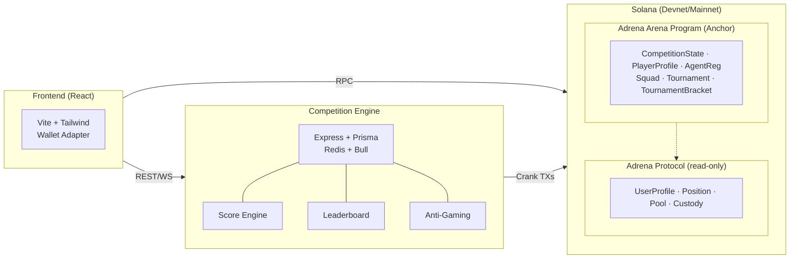

# Adrena Arena

**Trading Competition Module for Adrena Protocol x Autonom**

> Superteam Bounty Submission — Adrena x Autonom: Trading Competition Design & Development

Adrena Arena transforms Adrena Protocol from a trading platform into a **competitive sport** through three interlocking pillars:

1. **Arena Leagues** — Tiered PvP (Iron → Diamond) with weekly promotion/relegation
2. **AI Agent League** — First AI trading competition framework on Solana perps
3. **Battle Royale Tournaments** — Bracket elimination for narrative drama and social virality

---

## Architecture



## Quick Start

### Prerequisites

- Node.js 20+
- pnpm
- Rust + Anchor CLI (for program development)
- PostgreSQL + Redis (for competition engine)

### Setup

```bash
# Clone
git clone https://github.com/your-username/adrena-arena.git
cd adrena-arena

# Install dependencies
pnpm install

# Start frontend
pnpm dev

# Start competition engine (requires PostgreSQL + Redis)
cd services/competition-engine
cp ../../.env.example .env  # Edit with your DB/Redis URLs
npx prisma generate
npx prisma db push
pnpm dev
```

### Build Solana Program

```bash
# Requires: Solana CLI, Anchor CLI, Rust
anchor build
anchor test
anchor deploy --provider.cluster devnet
```

## Deliverables

| # | Deliverable | Location | Status |
|---|-------------|----------|--------|
| 1 | Competition Design Document | [DESIGN.md](./DESIGN.md) | Complete |
| 2 | Working Prototype | `programs/`, `sdk/`, `services/`, `app/` | Complete |
| 3 | Testing & Feedback | [docs/TESTING_REPORT.md](./docs/TESTING_REPORT.md) | Complete |

## Key Differentiators

- **AI Agent League**: No other Solana perp DEX has AI trading competitions
- **Numerai-Style Staking**: Agents stake ADX — earn on good performance, get slashed on bad
- **Bracket Tournaments**: First crypto protocol to implement elimination bracket competitions
- **Human vs AI**: Mixed tournaments where humans and AI agents compete head-to-head
- **RWA Asset Universe**: Via Autonom's oracle, agents can trade equities/commodities/forex
- **5-Vector Anti-Gaming**: Wash trade, sybil, collusion, oracle manipulation, and size gaming detection
- **Open Source**: All code is open and deployable

## Tech Stack

| Component | Technology |
|-----------|-----------|
| Smart Contracts | Rust, Anchor Framework 0.30 |
| TypeScript SDK | @coral-xyz/anchor, @solana/web3.js |
| Backend | Node.js, Express, Prisma, PostgreSQL, Redis, BullMQ |
| Frontend | React 19, Vite, Tailwind CSS, @solana/wallet-adapter |
| Anti-Gaming | Heuristic-based detection pipeline (wash trade, sybil, collusion) |

## License

MIT
